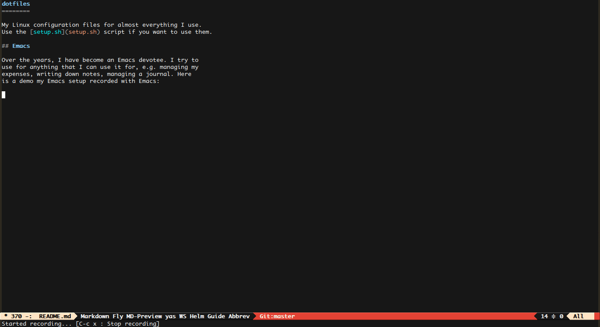

dotfiles
========

My Linux configuration files for almost everything I use. 
Use the [setup.sh](setup.sh) script if you want to use them.

## Emacs

Over the years, I have become an Emacs devotee. I try to
use for anything that I can use it for, e.g. managing my 
expenses, writing down notes, managing a journal. Here
is a demo my Emacs setup recorded with Emacs:

